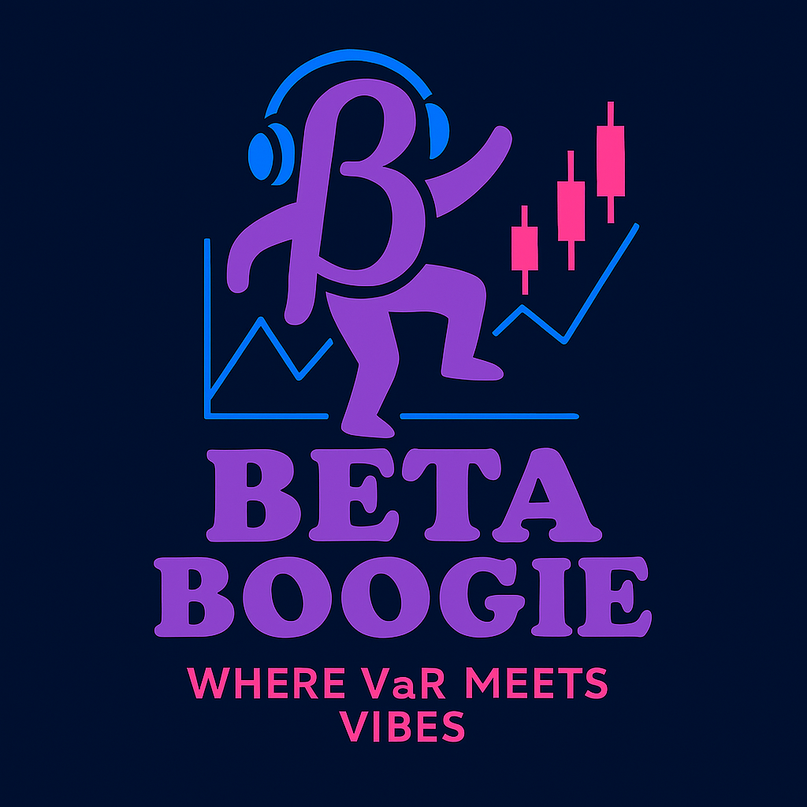

# Beta Boogie



**Beta Boogie** is a web-based financial risk analytics platform designed to calculate, visualize, and explore the volatility and Value at Risk (VaR) of custom portfolios. Built with Next.js and FastAPI, it's your one-stop groove for getting in sync with market uncertainty.

---

## Project Roadmap

View the full roadmap in docs/roadmap.md

Check out upcoming models in docs/volatility_models.md

---

## ✨ Features

- 📊 Historical VaR analysis (in-progress!)
- 🧮 Rolling, EWMA, and GARCH volatility estimates (coming soon!)
- 🔐 User authentication and saved portfolios (coming soon!)
- 📈 Interactive charts with VaR thresholds (coming soon!)
- 📥 PDF + CSV report generation (coming soon!)
- 🤖 Future integration with deep learning and transformers (coming...later!)

---

## 🚀 Live Demo

*Will add once deployed*

---

## 📸 Screenshots

*Coming soon...*

---

## 🛠️ Tech Stack

- **Frontend**: Next.js (App Router), Tailwind CSS, Chart.js
- **Backend**: FastAPI, Pandas, NumPy, `arch`, yfinance
- **Auth**: Clerk/Auth.js (*planned*)
- **Database**: PostgreSQL with SQLAlchemy (*planned*)
- **Architecture**: REST API between frontend and backend

---

## 🧪 Getting Started

```bash
# Clone repo
git@github.com:dracaena-daddy/Beta-Boogie.git

# Frontend setup
cd /frontend
npm install
npm run dev

# Backend setup
cd /backend
pip install -r requirements.txt
uvicorn main:app --reload
```

---

*This project is part of a graduate project in Computer Science at Towson University*
